# Spring Boot OAuth2 JWT Application - UML Documentation

This document contains comprehensive UML diagrams for the Spring Boot OAuth2 JWT authentication application.

## 1. Class Diagram

The class diagram shows the structure of all classes and their relationships in the application:

## 2. Sequence Diagram

The sequence diagram illustrates the authentication flow and interaction between components:

## 3. Package Structure Diagram

The package diagram shows the organization of classes within the application packages:

```mermaid
---
title: Spring Boot OAuth2 Project - Package Structure
---
flowchart TD
    subgraph "com.example.demooauth2headers"
        
        subgraph "Main Application"
            Main["🚀 DemoOauth2HeadersApplication<br/>@SpringBootApplication"]
        end
        
        subgraph "controller"
            AuthCtrl["🔐 AuthController<br/>@RestController<br/>/auth/**"]
            ApiCtrl["🛡️ ApiController<br/>@RestController<br/>/api/**"]
        end
        
        subgraph "service"
            JwtSrv["🎫 JwtService<br/>@Service<br/>JWT Operations"]
        end
        
        subgraph "config"
            SecConfig["🔧 SecurityConfig<br/>@Configuration<br/>@EnableWebSecurity"]
        end
        
        subgraph "filter"
            JwtFilter["🔍 JwtAuthenticationFilter<br/>@Component<br/>extends OncePerRequestFilter"]
        end
        
        subgraph "dto"
            LoginReq["📝 LoginRequest<br/>@Valid"]
            RefreshReq["📝 RefreshRequest<br/>@Valid"]
            AuthResp["📄 AuthResponse"]
        end
    end
    
    subgraph "Spring Framework Dependencies"
        SpringSec["🛡️ Spring Security"]
        SpringWeb["🌐 Spring Web"]
        SpringBoot["⚡ Spring Boot"]
        JWT["🎫 JJWT Library"]
    end
    
    subgraph "External Resources"
        AppYml["📋 application.yml<br/>JWT Configuration"]
        PomXml["📦 pom.xml<br/>Dependencies"]
        Tests["🧪 Tests<br/>Integration Tests"]
    end
    
    %% Relationships
    Main --> AuthCtrl
    Main --> ApiCtrl
    Main --> JwtSrv
    Main --> SecConfig
    Main --> JwtFilter
    
    AuthCtrl --> JwtSrv
    AuthCtrl --> LoginReq
    AuthCtrl --> RefreshReq
    AuthCtrl --> AuthResp
    
    JwtFilter --> JwtSrv
    SecConfig --> JwtFilter
    
    %% Dependencies
    Main -.-> SpringBoot
    AuthCtrl -.-> SpringWeb
    SecConfig -.-> SpringSec
    JwtSrv -.-> JWT
    
    Main -.-> AppYml
    Main -.-> PomXml
    Tests -.-> Main
    
    %% Styling
    classDef main fill:#FFE082,stroke:#F57F17,stroke-width:3px
    classDef controller fill:#E1F5FE,stroke:#0277BD,stroke-width:2px
    classDef service fill:#F3E5F5,stroke:#7B1FA2,stroke-width:2px
    classDef config fill:#FFF3E0,stroke:#EF6C00,stroke-width:2px
    classDef filter fill:#FCE4EC,stroke:#C2185B,stroke-width:2px
    classDef dto fill:#E8F5E8,stroke:#388E3C,stroke-width:2px
    classDef spring fill:#F5F5F5,stroke:#616161,stroke-width:1px,stroke-dasharray: 5 5
    classDef resource fill:#FFF8E1,stroke:#F9A825,stroke-width:2px
    
    class Main main
    class AuthCtrl,ApiCtrl controller
    class JwtSrv service
    class SecConfig config
    class JwtFilter filter
    class LoginReq,RefreshReq,AuthResp dto
    class SpringSec,SpringWeb,SpringBoot,JWT spring
    class AppYml,PomXml,Tests resource
```

## 4. Component Descriptions

### Controllers
- **AuthController**: Handles authentication endpoints (`/auth/login`, `/auth/refresh`)
- **ApiController**: Manages protected API endpoints (`/api/hello`)

### Services
- **JwtService**: Core JWT operations (generation, validation, parsing)

### Configuration
- **SecurityConfig**: Spring Security configuration with CORS and stateless session management

### Filters
- **JwtAuthenticationFilter**: Processes JWT tokens from incoming requests

### DTOs
- **LoginRequest**: Request payload for login endpoint
- **RefreshRequest**: Request payload for refresh endpoint  
- **AuthResponse**: Standard response format for auth operations

### Key Features Illustrated

1. **Dependency Injection**: Spring's IoC container manages all component relationships
2. **Security Filter Chain**: JWT filter intercepts requests before reaching controllers
3. **Stateless Authentication**: No server-side session storage
4. **Token-based Authorization**: Access and refresh token pattern
5. **CORS Support**: Cross-origin resource sharing enabled
6. **Validation**: Input validation using Bean Validation annotations

### Security Flow Summary

1. **Authentication**: Client sends credentials → generates JWT tokens
2. **Authorization**: Client includes JWT in header → validates and processes request  
3. **Token Refresh**: Client sends refresh token → generates new access token
4. **Error Handling**: Invalid requests return appropriate HTTP status codes

This UML documentation provides a complete architectural overview of the Spring Boot OAuth2 JWT application.