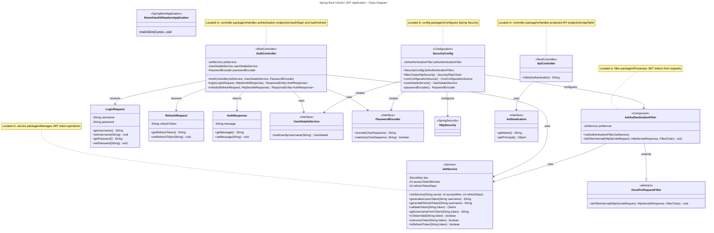

```mermaid
---
title: Spring Boot OAuth2 JWT Application - Class Diagram
---
classDiagram
    %% Main Application Class
    class DemoOauth2HeadersApplication {
        <<SpringBootApplication>>
        +main(String[] args)$ void
    }

    %% Controllers
    class AuthController {
        <<RestController>>
        -JwtService jwtService
        -UserDetailsService userDetailsService
        -PasswordEncoder passwordEncoder
        +AuthController(JwtService, UserDetailsService, PasswordEncoder)
        +login(LoginRequest, HttpServletResponse) ResponseEntity~AuthResponse~
        +refresh(RefreshRequest, HttpServletResponse) ResponseEntity~AuthResponse~
    }

    class ApiController {
        <<RestController>>
        +hello(Authentication) String
    }

    %% Services
    class JwtService {
        <<Service>>
        -SecretKey key
        -int accessTokenMinutes
        -int refreshTokenDays
        +JwtService(String secret, int accessMins, int refreshDays)
        +generateAccessToken(String username) String
        +generateRefreshToken(String username) String
        +validateToken(String token) Claims
        +getUsernameFromToken(String token) String
        +isTokenValid(String token) boolean
        +isAccessToken(String token) boolean
        +isRefreshToken(String token) boolean
    }

    %% Configuration
    class SecurityConfig {
        <<Configuration>>
        -JwtAuthenticationFilter jwtAuthenticationFilter
        +SecurityConfig(JwtAuthenticationFilter)
        +filterChain(HttpSecurity) SecurityFilterChain
        +corsConfigurationSource() CorsConfigurationSource
        +userDetailsService() UserDetailsService
        +passwordEncoder() PasswordEncoder
    }

    %% Filters
    class JwtAuthenticationFilter {
        <<Component>>
        -JwtService jwtService
        +JwtAuthenticationFilter(JwtService)
        +doFilterInternal(HttpServletRequest, HttpServletResponse, FilterChain) void
    }

    %% DTOs
    class LoginRequest {
        -String username
        -String password
        +getUsername() String
        +setUsername(String) void
        +getPassword() String
        +setPassword(String) void
    }

    class RefreshRequest {
        -String refreshToken
        +getRefreshToken() String
        +setRefreshToken(String) void
    }

    class AuthResponse {
        -String message
        +getMessage() String
        +setMessage(String) void
    }

    %% Spring Framework Classes (External)
    class UserDetailsService {
        <<interface>>
        +loadUserByUsername(String) UserDetails
    }

    class PasswordEncoder {
        <<interface>>
        +encode(CharSequence) String
        +matches(CharSequence, String) boolean
    }

    class OncePerRequestFilter {
        <<abstract>>
        +doFilterInternal(HttpServletRequest, HttpServletResponse, FilterChain) void*
    }

    class HttpSecurity {
        <<SpringSecurity>>
    }

    class Authentication {
        <<interface>>
        +getName() String
        +getPrincipal() Object
    }

    %% Relationships
    AuthController --> JwtService : uses
    AuthController --> UserDetailsService : uses
    AuthController --> PasswordEncoder : uses
    AuthController --> LoginRequest : receives
    AuthController --> RefreshRequest : receives
    AuthController --> AuthResponse : returns

    ApiController --> Authentication : uses

    SecurityConfig --> JwtAuthenticationFilter : configures
    SecurityConfig --> UserDetailsService : creates
    SecurityConfig --> PasswordEncoder : creates
    SecurityConfig --> HttpSecurity : configures

    JwtAuthenticationFilter --|> OncePerRequestFilter : extends
    JwtAuthenticationFilter --> JwtService : uses

    %% Package annotations
    note for AuthController "Located in: controller package\nHandles authentication endpoints\n/auth/login and /auth/refresh"
    note for ApiController "Located in: controller package\nHandles protected API endpoints\n/api/hello"
    note for JwtService "Located in: service package\nManages JWT token operations"
    note for SecurityConfig "Located in: config package\nConfigures Spring Security"
    note for JwtAuthenticationFilter "Located in: filter package\nProcesses JWT tokens from requests"

    %% Styling
    classDef controller fill:#e1f5fe,stroke:#0277bd,stroke-width:2px
    classDef service fill:#f3e5f5,stroke:#7b1fa2,stroke-width:2px
    classDef config fill:#fff3e0,stroke:#ef6c00,stroke-width:2px
    classDef dto fill:#e8f5e8,stroke:#388e3c,stroke-width:2px
    classDef filter fill:#fce4ec,stroke:#c2185b,stroke-width:2px
    classDef spring fill:#f5f5f5,stroke:#616161,stroke-width:1px,stroke-dasharray: 5 5

    class AuthController:::controller
    class ApiController:::controller
    class JwtService:::service
    class SecurityConfig:::config
    class LoginRequest:::dto
    class RefreshRequest:::dto
    class AuthResponse:::dto
    class JwtAuthenticationFilter:::filter
    class UserDetailsService:::spring
    class PasswordEncoder:::spring
    class OncePerRequestFilter:::spring
    class HttpSecurity:::spring
    class Authentication:::spring
```