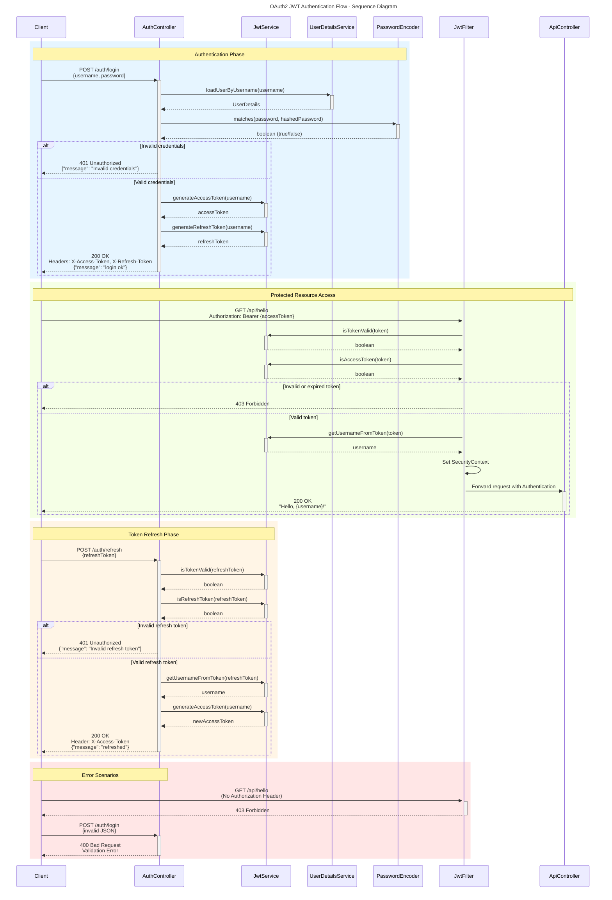

```mermaid
---
title: OAuth2 JWT Authentication Flow - Sequence Diagram
---
sequenceDiagram
    participant Client
    participant AuthController
    participant JwtService
    participant UserDetailsService
    participant PasswordEncoder
    participant JwtFilter
    participant ApiController

    %% Login Flow
    rect rgb(230, 245, 255)
    note over Client, PasswordEncoder: Authentication Phase
    Client->>+AuthController: POST /auth/login<br/>{username, password}
    AuthController->>+UserDetailsService: loadUserByUsername(username)
    UserDetailsService-->>-AuthController: UserDetails
    AuthController->>+PasswordEncoder: matches(password, hashedPassword)
    PasswordEncoder-->>-AuthController: boolean (true/false)
    
    alt Invalid credentials
        AuthController-->>Client: 401 Unauthorized<br/>{"message": "Invalid credentials"}
    else Valid credentials
        AuthController->>+JwtService: generateAccessToken(username)
        JwtService-->>-AuthController: accessToken
        AuthController->>+JwtService: generateRefreshToken(username)
        JwtService-->>-AuthController: refreshToken
        AuthController-->>-Client: 200 OK<br/>Headers: X-Access-Token, X-Refresh-Token<br/>{"message": "login ok"}
    end
    end

    %% Protected Resource Access
    rect rgb(245, 255, 230)
    note over Client, ApiController: Protected Resource Access
    Client->>+JwtFilter: GET /api/hello<br/>Authorization: Bearer {accessToken}
    JwtFilter->>+JwtService: isTokenValid(token)
    JwtService-->>-JwtFilter: boolean
    JwtFilter->>+JwtService: isAccessToken(token)
    JwtService-->>-JwtFilter: boolean
    
    alt Invalid or expired token
        JwtFilter-->>Client: 403 Forbidden
    else Valid token
        JwtFilter->>+JwtService: getUsernameFromToken(token)
        JwtService-->>-JwtFilter: username
        JwtFilter->>JwtFilter: Set SecurityContext
        JwtFilter->>+ApiController: Forward request with Authentication
        ApiController-->>-Client: 200 OK<br/>"Hello, {username}!"
    end
    end

    %% Token Refresh Flow
    rect rgb(255, 245, 230)
    note over Client, JwtService: Token Refresh Phase
    Client->>+AuthController: POST /auth/refresh<br/>{refreshToken}
    AuthController->>+JwtService: isTokenValid(refreshToken)
    JwtService-->>-AuthController: boolean
    AuthController->>+JwtService: isRefreshToken(refreshToken)
    JwtService-->>-AuthController: boolean
    
    alt Invalid refresh token
        AuthController-->>Client: 401 Unauthorized<br/>{"message": "Invalid refresh token"}
    else Valid refresh token
        AuthController->>+JwtService: getUsernameFromToken(refreshToken)
        JwtService-->>-AuthController: username
        AuthController->>+JwtService: generateAccessToken(username)
        JwtService-->>-AuthController: newAccessToken
        AuthController-->>-Client: 200 OK<br/>Header: X-Access-Token<br/>{"message": "refreshed"}
    end
    end

    %% Error Scenarios
    rect rgb(255, 230, 230)
    note over Client, AuthController: Error Scenarios
    Client->>+JwtFilter: GET /api/hello<br/>(No Authorization Header)
    JwtFilter-->>-Client: 403 Forbidden
    
    Client->>+AuthController: POST /auth/login<br/>{invalid JSON}
    AuthController-->>-Client: 400 Bad Request<br/>Validation Error
    end

    %% Styling
    activate Client
    activate AuthController
    activate JwtService
    activate UserDetailsService
    activate PasswordEncoder
    activate JwtFilter
    activate ApiController
```